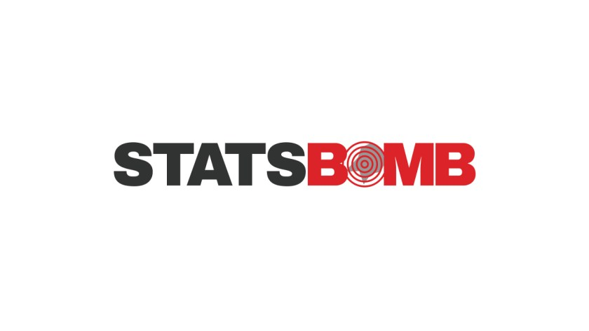

```{r setup, include=FALSE}
knitr::opts_chunk$set(echo = F, message = F, warning = F)

library(tidyverse)
library(readr)
library(gt)
library(gtExtras)
library(fontawesome)
```

# Módulo VI:<br>Mestrado BIG DATA APLICADO AO FUTEBOL{#principal-cover}

## EXERCÍCIO PRÁTICO{#title}

::: {#dot-div}


:::


## Footer{#footer}

- Aluno: Cassio Félix Jardim
- email: cassiofjardim@gmail.com

# Page-1{#principal .page-1}

## Escolhendo um Provedor de dados{#ex-1 .ex-1_title}

VocÊ foi contratado para gerir o departamento de Analytics de um grande clube Portuguê. Foi lhe pedido para contratar um fornecedor de dados desportivos para comeC'ar o projeto. Qual seria a empresa que você escolheria e Porque?

### Provedores Pagos {#provedor-pago}

{#opta}
<span id = "p-below-img">Uma das maiores empresas de Base de Dados no Futebol. O fornecimento dos dados´ pago e de alto valor. Os destaques principais sC#o os dados não-estruturados (videos e imagens por exemplo)</span>


{#statsbomb}
<span id = "p-below-img">Empresa que investe na análise de dados estruturados e não estruturados( videos e imagens, por exemplo). Além disso, a empresa é muito engajada em estar trazendo novidades sobre novas métricas na análise de futebol. Vale muito a pena acompanhar as atualizações em sua conta do <span style = "color: steelblue; font-weight: bold;">[Twitter](https://twitter.com/statsbomb)</span> [`r fa("twitter", fill = "steelblue")`](https://twitter.com/statsbomb). Dependendo do tipo de dado o acesso é livre. </span>


{#wyscout}
<span id = "p-below-img">Outra grande fornecedora de dados para o futebol. A WYSCOUT possui planos para o acesso aos dados, sendo acessC-vel a clubes, agentes e pesquisadores.[wyscout](https://wyscout.com/pricing/)</span>

### Provedores Livres {#provedor-livre}


{#fbref}
<span id = "p-below-img">FBREF é uma base de dados muito interessante por ser vasta e de acesso livre. Dependendo da liga de interesse (Premiere League, La Liga, Seria A, por exemplo), pode se fazer um estudos detalhados de equipes e jogadores utilizando seus dados.</span>

{#transfermarket}
<span id = "p-below-img">Transfermarket é uma base de dados sobre finanças do futebol. Base de dados com informações pessoais e de valor de mercado de jogadores e clubes. </span>

{#understat}
<span id = "p-below-img">Understat segue na linha da FBREF. No entanto, a UNDERSTAT fornece algumas métricas que não estCão presentes na FBREF.</span>

{#logo-R-package}
<span id = "p-below-img">Para termos acesso de uma forma facilitada e direta as bases de dados da FBREF, Footmob, Transfermarket e Understat, podemos utilizar os pacote `worldfootballR` para a linguagem R. Esse é o link para o repositC3rio do pacote: [worldfootballR package](https://github.com/JaseZiv/worldfootballR)</span>

###### Conclusão:
<span id = "resumo">Dessa forma podemos concluir que as empresas que fornecem dados sob uma assinatura paga estC#o na fronteira da criação, extração e fornecimento dos dados para o Futebol. No entanto, utilizar de bases de dados como FBREF e Understat, e mais ainda, cruzar essas bases de dados pode oferecer insights valiosos sobre jogadores e equipes.</span>

# Page-2{#principal .page-2}

## Data Scouting{#ex-2 .ex-2_title}

A primeira aplicação do departamento seria através do Scouting. A equipe precisa de um avanC'ado para substituir outro que acaba de sair. Selecione 4 métricas que você utilizaria para identificar o substituto e explique os motivos.

  - <span id = "list-1" style = "font-weight: bold; display: block;    text-align: left;font-size: 2rem;">`r fa("list", fill = "black")` Average Expected Goals (xG) vs Average goals:
    <span style = "line-height: 1.5; font-weight: 600; text-align:left;font-size:1.5rem;display: block;">Gols esperados (xG): É uma das métricas utilizadas hoje. Para atacantes xG traz uma importante referência sobre a eficácia/eficiência dos artilheiros. Além disso, relacionar essa métrica com a média de gols na temporada reforça a qualidade dessa métrica. Quanto maior for a média de gols diante do xG do atleta mais eficiente esse atacante será.</span>
    
    </span> 
    
  - <span id = "list-2" style = "font-weight: bold; display: block;    text-align: left;font-size: 2rem;">`r fa("list", fill = "black")` Average xG vs Average Touches in the box: 
    <span style = "line-height: 1.5; font-weight: 600; text-align:left;font-size:1.5rem;display: block;">Novamente iremos relacionar duas métricas. A media de gols Esperados e o numero de toques na bola dentro da grande area. Dessa forma, iremos ter alguma indicação da qualidade das ações desse atacante dentro da grande area. Quanto menor for a quantidade de toques dentro da grande area relativa a media de gols esperados mais eficiente será esse atacante.</span>
    
    </span>
    
  - <span id = "list-3" style = "font-weight: bold; display: block;    text-align: left;font-size: 2rem;">`r fa("list", fill = "black")` Average Shots vs Average Shots on target: 
    <span style = "line-height: 1.5; font-weight: 600; text-align:left;font-size:1.5rem;display: block;">Relacionar o numero de Chutes com o numero de chutes no alvo, reflete a precisão das finalizações desse atleta. Quanto maior for a razão*Av. Shots on Target(SoT)*/*Average Shots(Sh)* maior o nivel de precisão desse atacante.</span>
    
    </span>
    
  
  - <span id = "list-4" style = "font-weight: bold; display: block;    text-align: left;font-size: 2rem;">`r fa("list", fill = "black")` Average Dribbles vs Average Shots: 
    <span style = "line-height: 1.5; font-weight: 600; text-align:left;font-size:1.5rem;display: block;">Estabelecer uma relação entre uma media de dribles e uma media de chutes pode ser um bom indicador da caracteristica do jogador. Se estivermos pensando em um Atacante mais fixo de Area talvez seja bem provável que a media de chutes seja superior seja que a media de dribles. Para um jogador de lado de campo é esperado que o oposto aconteça.</span>
    
    </span>

# Page-3{#principal .page-3}

## Transfermarket{#ex-3 .ex-3_title}

O seu presidente definiu que é necessário que o substituto seja um jogador livre no mercado e sub23. Vá até o Transfermarkt e faça uma lista de jogadores que se encaixam no perfil desejado.

```{r main-table}

table_ex_4_a<-read.csv2(file = 'data/table_a.csv')

table_a <- gt(table_ex_4_a %>% select(-player_url,-country,-player_market_value_euro,
                                      -player_position, -player_foot), id = "main")%>%
  
  # subtitle = md("Totales en 18 temporadas"))
  gt_theme_espn()  %>% 
  tab_header(
    title = html(glue::glue("<div id = 'tab-h1'>
                                <h3 style = 'text-align: center;
                                             font-size: 4rem !important;
                                             font-weight: 900'>
                                  Top Atacantes Sub-23 Livres no Mercado
                                  </span>
                                </h3>
                             </div>"
    ))) %>%
  gt_img_rows(player_nationality,img_source = "local")%>%
  cols_align(align = "center")%>%
  
  cols_label(comp_name = "Comp.", squad = "Equipe", player_name = 'Jogador',
             player_age = "Idade", player_nationality = "Pais",
             player_height_mtrs = 'Altura(m)', contract_expiry = "Data Contrato") %>%
  # tab_source_note("DATA: Transfermarket")%>%
  tab_options(column_labels.background.color = "lightblue",
              table.font.weight = "bold",
              data_row.padding = px(2.5)) %>%
  
  opt_css(
    css = "
    #main .gt_table{
         /* margin-left: 20rem !important;*/
         margin-bottom: 2rem !important;
         background-image:-webkit-linear-gradient(217deg, #dee5eb 80.4%, #f1f1f1 50%)  !important;

    }
    
    #main .gt_font_normal {
    font-weight: normal;
    border-top: 5px solid #dee5eb;
    background-image: -webkit-linear-gradient(217deg, #dee5eb 105.4%, #f1f1f1 50%)  !important;
}
    
    ") %>% tab_source_note(
      html('<b>Source:</b>
           <a href="https://fbref.com/en">
           Transfermarket</a>
           <br>
           <b>Temporada 2021/2022</b>
           '))

table_a

```
 
::: {#individual-table-0 .ind-table}

```{r}

table_ex_4_b<-read.csv2(file = 'data/table_b.csv')

# Face Pictures
antony <- "../../img/modulo_6/Antony.jpg"
# broja <- "https://i.imgur.com/YozIsU7.jpg"
broja <- "../../img/modulo_6/Armando Broja.jpg"
# salcedo <- "https://i.imgur.com/kv6dJqH.jpg"
salcedo <- "../../img/modulo_6/Eddie Salcedo.jpg"
# mbappe <- "https://i.imgur.com/hwb3iv8.jpg"
mbappe <- "../../img/modulo_6/Kylian-Mbappe.jpg"
# satriano <- "https://i.imgur.com/mrO72HH.jpg"
satriano <- "../../img/modulo_6/Martin-Satriano.jpg"
# renato <- "https://i.imgur.com/1GIeG42.jpg"
renato <- "../../img/modulo_6/Renato-Junior.jpg"
# ricardinho <- "https://i.imgur.com/LfyS1QY.jpg"
ricardinho <- "../../img/modulo_6/Ricardinho.jpg"

# Flags Pictures
# antony_flag <- "https://i.imgur.com/qY1n9RL.png"
antony_flag <- '../../img/modulo_6/icons8-brazil-24.png'
# broja_flag <- "https://i.imgur.com/roym8Mc.png"
broja_flag <- '../../img/modulo_6/icons8-albania-24.png'
# salcedo_flag <- "https://i.imgur.com/TWbX8Uc.png"
salcedo_flag <- '../../img/modulo_6/icons8-italy-24.png'
# mbappe_flag <- "https://i.imgur.com/ZUrj30g.png"
mbappe_flag <- '../../img/modulo_6/icons8-france-24.png'
# satriano_flag <- "https://i.imgur.com/Oe6pCdE.png"
satriano_flag <- '../../img/modulo_6/icons8-uruguay-24.png'
# renato_flag <- "https://i.imgur.com/qY1n9RL.png"
renato_flag <- '../../img/modulo_6/icons8-brazil-24.png'
# ricardinho_flag <- "https://i.imgur.com/qY1n9RL.png"
ricardinho_flag <- '../../img/modulo_6/icons8-brazil-24.png'

df<-tibble(players_pictures = c(antony,broja,salcedo,mbappe,satriano,renato,ricardinho),
           flags = c(antony_flag,broja_flag,salcedo_flag,mbappe_flag,satriano_flag,renato_flag,ricardinho_flag),
           MP = c(9,22,20,3,9,12,10),
           Min = c(402,1862,1146,95,217,341,458),
           Gls = c(0,12,6,2,1,0,1),
           Ast = c(0,10,0,0,0,0,0),
           xG = c(1.4,13.4,5.4,1.1,NA,NA,NA))

players_tables <- table_ex_4_b %>%
  arrange(player_name) %>%
  bind_cols(df) %>%

  relocate(flags,.after = player_name) %>%

  select(-player_url) %>%

  ungroup()%>% rename(Lesoes_dias ='dias_inj',Jogos_Fora = 'missing_games')%>%
  relocate(players_pictures, .before = flags)%>%
  pivot_longer(cols = c('Lesoes_dias':last_col()), names_to = 'Info.')


players_table_function <- function(x, url){

  gt(players_tables %>% filter(player_name == x, Info. != 'MP')%>%
       # slice(c(n(), 3:(n()-1),2, 1)) %>%
       mutate(Info. = case_when(Info. == 'Lesoes_dias' ~ 'Dias Fora(Lesão)',                                   Info. == 'Jogos_Fora' ~ 'Jogos Fora(Lesão)',
                                TRUE ~ Info.,
                                )), id = 'individual') %>%
    gt_theme_espn() %>%
    cols_hide(c(player_name,players_pictures, flags)) %>%

    # cols_label(Lesoes_dias = "Dias Fora(Lesões)",
    #            Jogos_Fora =  "Jogos Fora(Lesões)")%>%
    tab_header(
      title = html(glue::glue("<div id = 'tab-h2'>
                              {x}
                              % filter(player_name == {x}) %>% pull(2) %>% unique()}'>

                              % filter(player_name == {x}) %>% pull(3) %>% unique()}'>
                             </div>"))) %>%

    tab_options(column_labels.background.color = "lightblue",
                table.font.weight = "bold",
                table.width = px(220),
                data_row.padding = px(2.5)
    ) %>%
    cols_align(align = "center") %>%
    cols_width(everything() ~ px(80)) %>%

    tab_footnote(
      footnote =
        "The index is based on the theory of PPP, the notion that in the long run exchange rates should move towards the rate
      that would equalise the prices of an identical basket of goods and services (in this case, a burger) in any two countries.",
      locations = cells_title("subtitle")
    )%>%
    tab_source_note(
      html('<link rel="stylesheet" href="https://cdnjs.cloudflare.com/ajax/libs/font-awesome/4.7.0/css/font-awesome.min.css">
           <b>Source:</b>
           <a href="https://fbref.com/en">
           FBREF website </a>
           <br>
           <b>Temporada 2021/2022</b>
           ')) %>%

    opt_css(
      css = "
   #individual colgroup {
    background-image: -webkit-linear-gradient(217deg, #dee5eb 51.4%, #f1f1f1 50%) !important;
   }

   div#individual .gt_table {
    border: 0px none;
}

   #individual .gt_table .gt_header tr th {
    background-image: linear-gradient(235deg, #dee5eb 87.4%, #f1f1f1 50%) !important;
   }

    #tab-h2 {

    text-align: center;
    }

    tr{
    font-family: 'Fira Mono', monospace !important;
    }

    a{
    color: #337ab7 !important;
    }

    ")
}
```

:::

## Comentários

Após filtragem dos dados da Transfermarket chegamos a uma lista de 7 jogadores que atendem as condições exigidas: serem sub-23 e com contrato expirando ou sem contrato. Todos os jogadores fazem parte das principais ligas da Europa. São elas: Liga Portuguesa(Bwin), Liga Francesa, Liga A italian e Premier League inglesa. A princípio, o fato de serem jogadores de liga de grande expressão na Europa conta como um ponto positivo na hora da escolha dos atletas. Mas podemos fazer mais. Analisando outras informações no Transfermarket podemos estabelecer um grau de prioridade na escolha dos atletas. 
Abaixo apresentamos análises individuais sobre os atletas levando em conta informações como: *tempo fora por causa de lesões*, *quantidade de jogos perdidos por causa de lesões*, *Gols*, *numero de assistencias(Ast.)* e *gols esperados (xG)* (informações valiosas para um bom atacante): 

::: {#individual-table-1 .ind-table}
 
```{r player1}
players_table_function("Antony")
```

- <span id = "list-transfer-p"><span id="pros">Prós: </span>Jogador com pouco histórico de contusões.</span> 

- <span id = "list-transfer-p"><span id="contra">Contra: </span>Pouca minutagem na temporada.</span>

```{r player2}
players_table_function('Armando Broja')
```

- <span id = "list-transfer-p"><span id="pros">Prós: </span> Jogador com boa media de gols, apesar das lesões que o prejudicaram na temporada. Um bom nivel de Assistências e Xg. Boa minutagem. Uma boa aposta.</span> 

- <span id = "list-transfer-p"><span id="contra">Contra: </span> As lesões impactaram no seu aproveitamento. A altura de 1.9m indica uma limitação na posição que ele pode ser utilizado.</span> 

:::


# Page-4{#principal .page-4}

## Transfermarket(Cont.)

::: {#individual-table-2 .ind-table}

```{r player3}
players_table_function('Eddie Salcedo')
```

- <span id = "list-transfer-p"><span id="pros">Prós: </span>Jogador com minutagem boa. Números de Gols superior ao xG, o que é um bom indicador para um atacante.</span>

- <span id = "list-transfer-p"><span id="contra">Contra: </span>Um dos jogadores que mais contusões sofreu. O jogador está na média dos seus concorrentes. Vale observar mais seus jogos.</span>

```{r player4}
players_table_function('Kylian Mbappe')

```

- <span id = "list-transfer-p"><span id="pros">Prós: </span>Jogador acima da media internacional. Uma das principais estrelas do campeonato Francês. Seus números mostram isso. Numero de gols acima de xG. Jogador que atua bem nos lados do campo e por dentro.</span>

- <span id = "list-transfer-p"><span id="contra">Contra: </span> Poucos fatores pesam contra o jogador.</span> 

:::

::: {#individual-table-3 .ind-table}

```{r player5}
players_table_function('Martin Satriano')

 
```

- <span id = "list-transfer-p"><span id="pros">Prós: </span>De todos os jogadores foi o que menos jogou. Pouca informações sobre o atleta</span> 

- <span id = "list-transfer-p"><span id="contra">Contra: </span>De todos os jogadores foi o que menos jogou. Pouca informações sobre o atleta </span>

```{r player6}
players_table_function('Renato Junior')
 
```

- <span id = "list-transfer-p"><span id="pros">Prós: </span>Jogador mais jovem da lista. Vale observar melhor seu rendimento nos próximos jogos.</span> 

- <span id = "list-transfer-p"><span id="contra">Contra: </span> Poucos jogos. Pouca informações sobre o atleta.</span> 

:::

## Conclusão:

Após realizarmos um primeiro e segundo filtro, chegamos a conclusão que dos 7 jogadores poderiamos estabelecer 3 prioridades:

- <span id = "transfer-p">{#mbappe-transfermarket}**Kylian Mbappe**: 

  O jogador mais valioso da lista. Vale o investimento porque o atelta encontra-se no auge de sua forma e com potencial de crescimento.</span>

- <span id = "transfer-p">{#borja-transfermarket}**Armando Broja**: 

  Jogador que possui bons números mesmo com as lesões na temporada. Além disso, atua na principal liga da Europa o que pesa muito ao seu favor.</span>

- <span id = "transfer-p">{#salcedo-transfermarket}**Eddie Salcedo**: 

  Uma ótima aposta. Tem bons números no campeonato italiano.</span>
